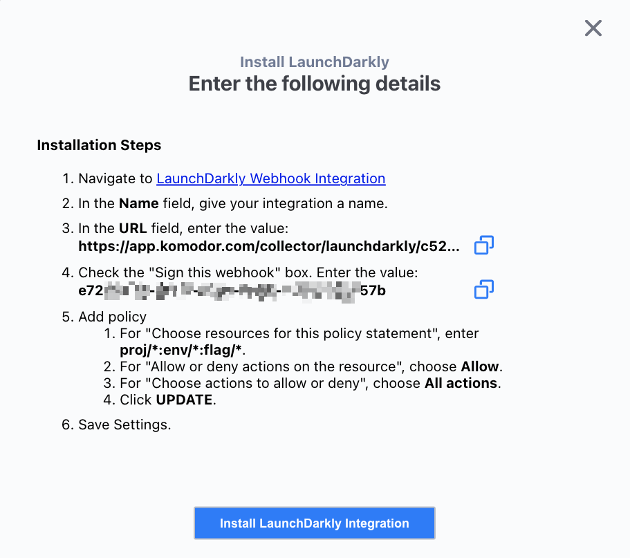
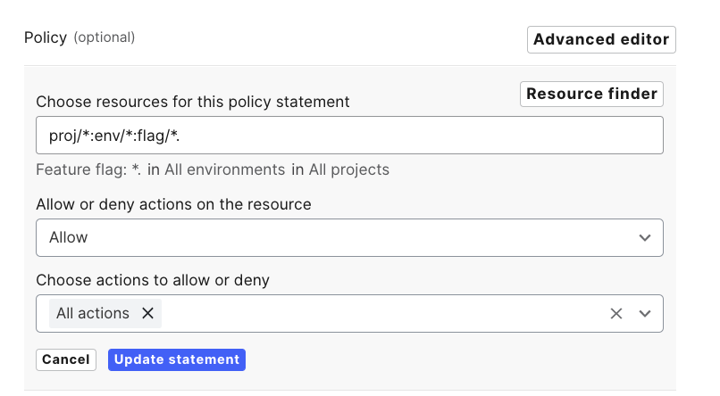

# LaunchDarkly Integration

Integration with LaunchDarkly extends the holistic view of the environment with flag change events on the timeline.

For example:

- Feature flag was turned on
- Feature flag in variation changed
- Feature flag targeting was changed

## Installation

### The LaunchDarkly integration involves two parts: 
1. Enabling the integration in Komodor.
2. Creating a LaunchDarkly webhook.

### Enabling the integration in Komodor
To enable the Komodor LaunchDarkly integration go to [Komodor integrations page](https://app.komodor.com/main/integration) and select LaunchDarkly


This will open a window with the LaunchDarkly webhook URL and sign key

*Note: you can use the `LaunchDarkly Webhook Integration` link to continue with the webhook creation

### Creating the LaunchDarkly webhook
To create the LaunchDarkly webhook go to [LaunchDarkly Webhook Integration Page](https://app.launchdarkly.com/default/integrations/webhooks/new)
and use the values from Komodor's integration page

1. Name: Your integration's name
2. URL:  Use the URL from the integration window in Komodor 
3. Check the "Sign this webhook" checkbox
4. Secret: Use the Secret value from the integration window in Komodor 

5. Filter Policy:
   To send all LaunchDarkly event to Komodor:
   1. press the "+ Add statment"

   2. Choose resources for this policy statement: ```proj/*:env/*:flag/*```
   3. Allow or deny actions on the resource: ```Allow```
   4. Choose actions to allow or deny: ```All actions```
   5. "**Update statement**"

6. Check "**I have read and agree to the [Integration Terms and Conditions](https://launchdarkly.com/policies/integrations)**"
7. "**Save Settings**" to finish the integration.
      
