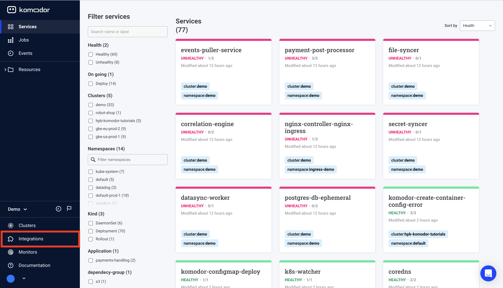
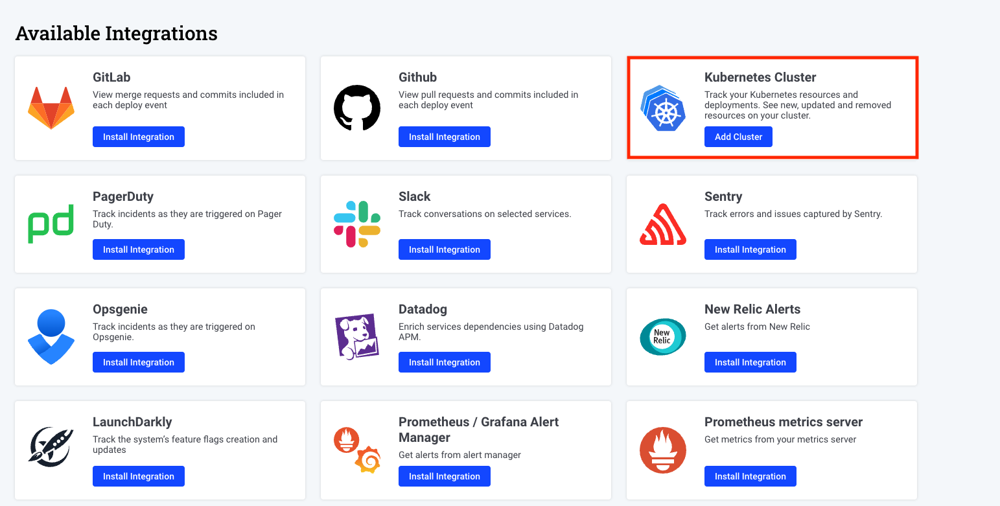

# Getting started

Welcome to Komodor, the dev-first Kubernetes operations platform 👋

Follow these instructions to quickly install our Agent on the clusters you want to manage, monitor, and track changes on.
<br /><br />To unlock Komodor’s full potential take a deep dive into the feature docs, and [join our Slack Kommunity](https://join.slack.com/t/komodorkommunity/shared_invite/zt-1lz4cme86-2zIKTRtTFnzL_UNxaUS9yw), where you can meet fellow Komodor users, exchange knowledge, and get support from our team.

<iframe width="560" height="315"
src="https://www.youtube.com/embed/StFiQtH8L8Q" 
frameborder="0" 
allow="accelerometer; autoplay; encrypted-media; gyroscope; picture-in-picture" 
allowfullscreen></iframe>

## What is Komodor

Komodor is a Kubernetes operations platform for developers, complete with automated playbooks for every K8s resource, and static-prevention monitors that enrich live & historical data with contextual insights to help enforce best practices and stop incidents in their tracks.
<br /><br />By baking K8s expertise directly into the product, Komodor is accelerating development cycles, reducing MTTR, and empowering dev teams to manage their K8s apps efficiently and independently.

## Agent Install

### Requirements

- Installed kubectl command-line tool.<br />
- Have a kubeconfig file (default location is ~/.kube/config).<br />
- Have an active connection to the desired cluster<br />
- Installed [Helm3](https://helm.sh/docs/intro/install/) or [Kustomize](https://kubectl.docs.kubernetes.io/installation/kustomize/)<br />

### Permissions

The Komodor agent uses the native RBAC model of Kubernetes. All the permissions are listed here:

1. [helm](https://github.com/komodorio/helm-charts/blob/master/charts/k8s-watcher/templates/clusterrole.yaml)
2. [kustomize base](https://github.com/komodorio/helm-charts/blob/master/manifests/base/clusterrole.yaml), [kustomize final](https://github.com/komodorio/helm-charts/blob/master/manifests/overlays/full/logs-reader.cr.yaml)

## Step 1 - Sign up to Komdor

To create your account, [sign up](https://app.komodor.com/#mode=signUp) for Komodor with your email address or by using SSO via your Google, GitHub or Microsoft accounts.

## Step 2 - Installing the Agent

- The main installation method uses Helm 3.0 to install the Komodor Agent on your cluster
- If you aren’t using Helm, you can install the Agent with [Kustomize](#kustomize-install), or with our guided installation script using Bash [Linux/Mac] or Powershell [Windows]
- You can also install the Agent manually using the Helm command template below

### Guided install


<br /><br />

1. Pick the relevant script: Powershell (Windows) or Bash (Linux/Mac), run it in your shell/terminal and follow the steps in the installation script. <br />
2. Our guided install script will run the following actions for you:<br />

- Make sure you have KubeCTL
- Get the cluster from your current context (If you want to install on a different context - change it and run the command again)
- Set the cluster display name in Komodor using the current context (You can choose to use a custom name if you prefer)
- Verify you have the latest version of Helm
- Run and install the Agent using Helm

### Helm install


1. Pick Helm out of the installation options.
2. The Helm command generates a unique API key and defines the cluster name.
3. Copy the Helm command into your terminal, and run the command.

### Template for manual Helm install

You can also manually build and run the following Helm command:

```bash
helm repo add komodorio https://helm-charts.komodor.io
helm repo update
helm upgrade --install k8s-watcher komodorio/k8s-watcher \
 --set apiKey=YOUR_API_KEY_HERE \
 --set watcher.clusterName=CLUSTER_NAME \
 --set watcher.enableAgentTaskExecution=true \
 --set watcher.allowReadingPodLogs=true
```

### Kustomize install

Alternatively you can use the following Kustomize command:

```bash
export KOMOKW_API_KEY= # API KEY Required
export KOMOKW_CLUSTER_NAME= # Cluster name the will be presented in Komodor
kubectl create ns komodor
kubectl apply -n komodor -k https://github.com/komodorio/helm-charts/manifests/overlays/full/?ref=master
```

The API key can be found in the Integration page.

## Step 3 - Integrate additional clusters

1. Go to the Integration page by clicking the Integrations tab on the lefthand navigation menu.
   

2. Click on ‘Add Cluster’ in the Kubernetes cluster integration prompt.
   

Follow the installation instructions in [step2](#step-2-installing-the-agent)

## Step 4 - Start exploring the platform

After installing the Komodor Agent you will be able to view all the K8s resources in your clusters on the Komodor platform web UI. <br /><br />


To unlock Komodor’s full potential take a deep dive into the feature docs. Take a glance below at some of the key capabilities Komodor has to offer.

👁️ Observe: Cross-cluster Visibility
Uncover your resources with a robust K8s dashboard
Easily explore and navigate through your Kubernetes resources across clusters from a single pane of glass
View metrics, logs, K8s events and inspect resources in real-time

Learn how to [set up your first monitors](./Monitors.md) for each K8s resource

⚙️ Manage: Simplified Cluster Management
Easily run day-to-day operations like restarting a service, rollbacks, comparing resources, setting requests/limits, etc.
Control more complex configurations by editing resources, manifests and config files
Validate your K8s configurations with real-time feedback for best practices

Learn how to [interact](./Actions/Overview.md) with your K8s cluster using Komodor

🛠️ Troubleshoot: Automated and Guided
View the entire history of changes and events to quickly correlate issues
Instantly know if an issue is infra or app-related
Run automatic playbooks for common K8s incidents
Get simple remediation instructions and take action with just one click

Learn how to use Komodor to [troubleshoot](https://youtu.be/nmgVHuv5T6A) issues in your K8s application

## Advanced Configuration

To learn more about advance configuration for the Komodor agent - [Read here](./Komodor-Agent.md)
<br /><br /><br /><br />
