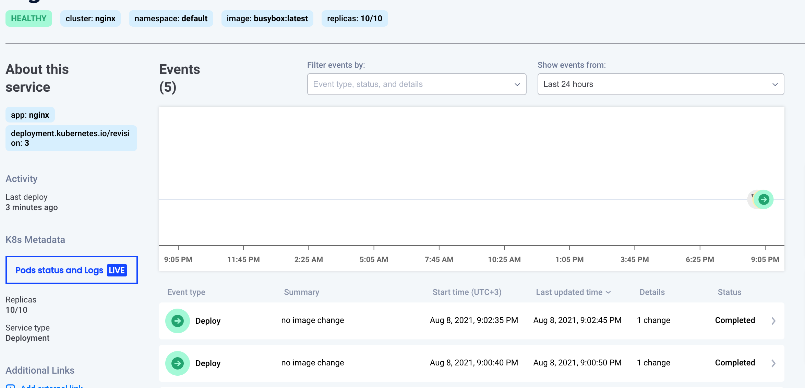
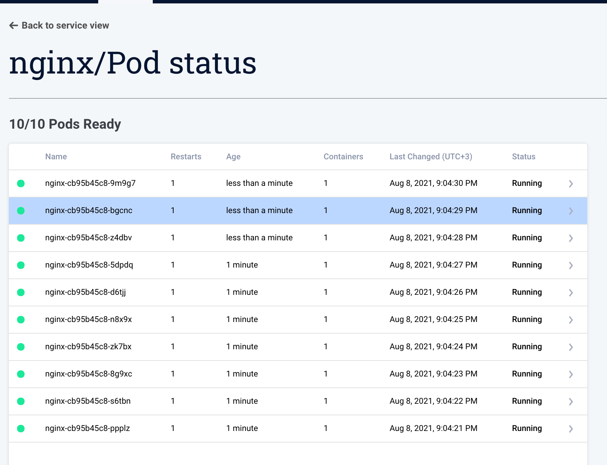
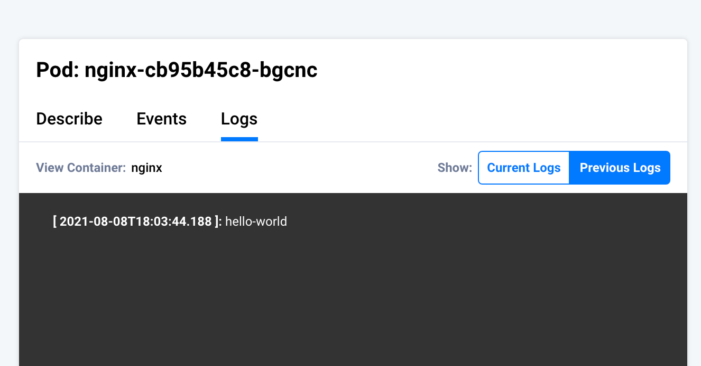

# Interaction with the Cluster

Interaction with the cluster allows you to speed up the troubleshooting process. This is done by asking Komodor's agent to perform actions in the cluster.

## Prerequisites
Install Komodor's watcher (version `>=0.1.44`) `--set watcher.enableAgentTaskExecution=true` to start the agent with the feature turned on (required for [Describe Action](#pod-description))
## Extra Permissions Required
In order to get logs from the cluster please use `--set watcher.allowReadingPodLogs=true` to update the RBAC manifests with the required [permissions](https://github.com/komodorio/helm-charts/blob/master/charts/k8s-watcher/templates/clusterrole.yaml#L95) (required for [Pod Log Action](#pod-logs))

!!! Note ""
    You can turn any of these flags off at any time to disable the features


### Upgrade
```bash
helm repo update
helm upgrade --install k8s-watcher komodorio/k8s-watcher --set watcher.enableAgentTaskExecution=true --set watcher.allowReadingPodLogs=true --reuse-values
```

## Live Pods
In the service, click on the `Pod Status and Logs` button.



The table shows all the pods that belong to the service based on the pod owner controller.



## Actions

### Pod Logs
Request logs from one of the pods will stream back the last 100 logs from the pod.


When a pod was previously restarted by Kubernetes you can see the logs just before the pod was restarted.


### Pod Description
Request returns the same output as `kubectl describe pod [NAME]`

