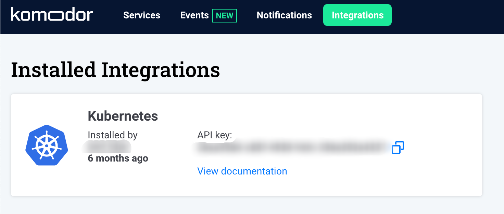

# The Komodor Agent

## Installation

### Get an API Key

The API key can be found in the [Integration page](https://app.komodor.com/main/integration).



### Helm

```bash
helm repo add komodorio https://helm-charts.komodor.io
helm repo update
helm upgrade --install k8s-watcher komodorio/k8s-watcher \
 --set apiKey=YOUR_API_KEY_HERE \
 --set watcher.clusterName=CLUSTER_NAME \
 --set watcher.enableAgentTaskExecution=true \
 --set watcher.allowReadingPodLogs=true
```

### Kustomize

```bash
export KOMOKW_API_KEY= # API KEY Required
export KOMOKW_CLUSTER_NAME= # Optional
kubectl create ns komodor
kubectl apply -n komodor -k https://github.com/komodorio/helm-charts/manifests/overlays/full/?ref=master
```

## Permissions

The Komodor agent uses the native RBAC model of Kubernetes. All the permissions are listed here:

1. [helm](https://github.com/komodorio/helm-charts/blob/master/charts/k8s-watcher/templates/clusterrole.yaml)
2. [kustomize base](https://github.com/komodorio/helm-charts/blob/master/manifests/base/clusterrole.yaml), [kustomize final](https://github.com/komodorio/helm-charts/blob/master/manifests/overlays/full/logs-reader.cr.yaml)

## ARM Support

Arm64 image is supported via docker manifest. 

## Advanced Configuration

You can configure the agent's functionality using the following configuration file: `komodor-k8s-watcher.yaml` (assuming the RBAC permissions are satisfied).
A more detailed list of the configurable parameters can be found [here](https://github.com/komodorio/helm-charts/tree/master/charts/k8s-watcher#configuration)

### Data Redaction

Learn how to set up [data redaction](./Sensitive-Information-Redaction.md) in Komodor

### Resources

By default, the Komodor agent watches the majority of the resources in your cluster.
You can enable/disable watching a resource using the following command:

1. Helm: `--set watcher.resources.RESOURCE=true/off`
2. Kustomize: update the configuration file and the RBAC rule to have `get`, `list` and `watch` permissions

### Namespaces

The Komodor agent watches all the namespaces (by default `watchNamespace=all`)

To watch a single namespace use the following command:

1. Helm: `--set watcher.watchNamespace=NAMESPACE`
2. Kustomize: patch the configuration file `watchNamespace=NAMESPACE`

#### Denylist

Using `namespacesDenylist` you can opt list of namespaces

### Agent Tasks

Agent tasks are used to interact with the cluster on demand, read more about interaction with the cluster [here](./Interaction-With-The-Cluster.md)

To enable agent tasks (default is `off`):

1. Helm: `--set watcher.enableAgentTaskExecution=true && --set watcher.allowReadingPodLogs=true`
2. Kustomize: The `full` overlay already has this turned on. If you are building it manually from `base`, patch the configuration file `enableAgentTaskExecution=true` and make sure to have RBAC permissions to `get` and `list` for `pods` and `pods/log`

### Environment Variables

Alternativly, you can pass the configuration as environment variables using the `KOMOKW_` prefix and by replacing all the . to _, for the root items the camelcase transforms into underscores as well.

For example:

```bash
# apiKey
KOMOKW_API_KEY=1a2b3c4d5e6f7g7h
# watcher.resources.replicaSet
KOMOKW_RESOURCES_REPLICASET=false

# watcher.watchNamespace
KOMOKW_WATCH_NAMESPACE=my-namespace
# watcher.collectHistory
KOMOKW_COLLECT_HISTORY=true
```

## Updating the agent

### Kustomize

```bash
kubectl apply -n komodor -k https://github.com/komodorio/helm-charts/manifests/overlays/full/?ref=master
```

### Helm

```bash
helm repo update
helm upgrade --install k8s-watcher komodorio/k8s-watcher --reuse-values
```

## Uninstalling

### Kustomize

```bash
kubectl delete ns komodor
```

### Helm

```bash
helm uninstall k8s-watcher
```
